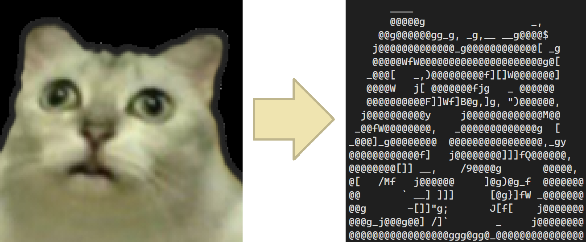

# Asciimage

Asciimage is a simple tool to convert images to ASCII art.

## Usage

Please refer [Wiki](https://github.com/GrapeJuicer/Asciimage/wiki).

## License

This project is licensed under the MIT License - see the [LICENSE](LICENSE.txt) file for details.
